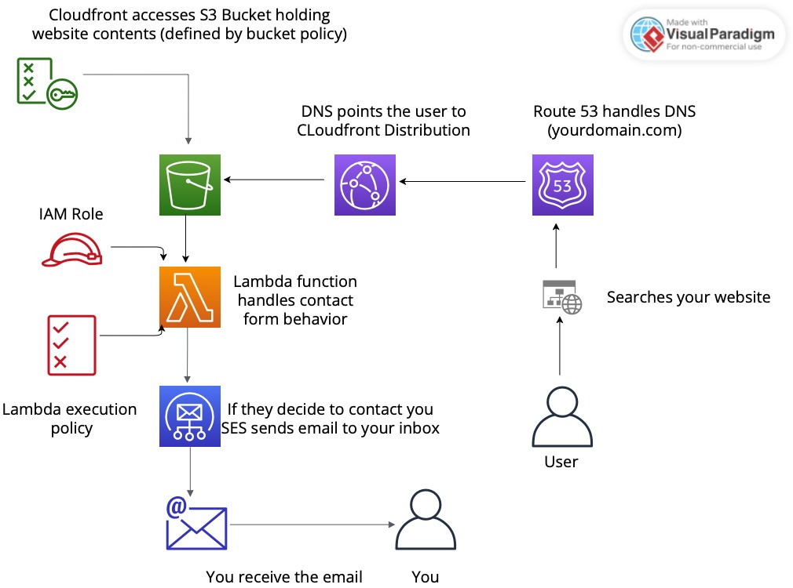

# s3-portfolio

A static portfolio website and the AWS architecture to host it — S3 for storage, CloudFront for delivery, Route 53 for DNS, and a serverless contact form built on API Gateway, Lambda, and SES, with Cloudflare Turnstile guarding against bot submissions.

The site itself is plain HTML, CSS, and vanilla JavaScript. No build step, no framework, no node_modules. Clone it, replace the placeholder content, and deploy.

---

## Architecture



Two independent paths:

**Serving the site.** Route 53 resolves your domain to a CloudFront distribution. CloudFront serves the objects in the S3 bucket over HTTPS from an edge location near the visitor. The bucket is not browsed directly — access is controlled by a bucket policy that admits CloudFront.

**Handling the contact form.** The form posts JSON to an API Gateway endpoint, which invokes a Lambda function. The function first verifies the Cloudflare Turnstile token against Cloudflare's siteverify API, then calls SES to email the submission to you. An IAM execution role grants the function exactly two things: `ses:SendEmail` and CloudWatch Logs.

## Repository contents

| File | Purpose |
|------|---------|
| `index.html` | The single-page site — home, about, experience, projects, contact |
| `style.css` | All styling, including the responsive breakpoints and the mobile nav |
| `script.js` | Mobile menu toggle and the contact-form submit handler |
| `lambda_code.py` | Lambda function — Turnstile verification plus SES send |
| `upload_script.sh` | Helper to copy named files up to the S3 bucket |
| `ArchitectureDiagram.jpg` | The diagram above |
| `your_photo.jpg`, `project_photo.heic` | Placeholder images |

## Prerequisites

- An AWS account
- [AWS CLI](https://docs.aws.amazon.com/cli/latest/userguide/getting-started-install.html) installed and configured (`aws configure`)
- A registered domain — in Route 53, or with an external registrar whose nameservers you can point at a Route 53 hosted zone
- A [Cloudflare account](https://dash.cloudflare.com/) for Turnstile (free; you do not need to move your DNS to Cloudflare)
- An email address you control, for SES to send from and to

## Configuration placeholders

Six values ship as placeholders and must be replaced before anything works:

| Where | Placeholder | Replace with |
|-------|-------------|--------------|
| `index.html` | `data-sitekey="WEBSITE_KEY"` | Your Turnstile **site key** |
| `script.js` | `https://execute-api.us-east-1.amazonaws.com/stage/resource` | Your API Gateway invoke URL |
| `upload_script.sh` | `s3://your-bucket-with website/` | Your bucket name (note: the placeholder contains a space — see [Known issues](#known-issues)) |
| Lambda env var | `SenderEmail` | SES-verified sender address |
| Lambda env var | `ReceiverEmail` | Where submissions should land |
| Lambda env var | `TurnstileKey` | Your Turnstile **secret key** |
| `lambda_code.py` | `Access-Control-Allow-Origin: https://www.igorwozlab.org` | Your own origin |

The site content is also all placeholder — `Name Surname`, `Job Title`, and lorem ipsum throughout `index.html`. Replace it with your own.

The Turnstile **secret key** belongs in a Lambda environment variable, never in the repository. The **site key** is public and lives in `index.html`.

---

## Deployment

### Part 1 — Static site

**1. Create the bucket**

```bash
aws s3 mb s3://your-portfolio-bucket --region us-east-1
```

Bucket names are globally unique. Keep Block Public Access **on** — CloudFront will reach the bucket through an Origin Access Control, so the bucket never needs to be public.

**2. Upload the site**

```bash
aws s3 sync . s3://your-portfolio-bucket \
  --exclude ".git/*" \
  --exclude "*.md" \
  --exclude "lambda_code.py" \
  --exclude "upload_script.sh" \
  --exclude "ArchitectureDiagram.jpg"
```

**3. Request a TLS certificate**

CloudFront only accepts certificates from **us-east-1**, regardless of where the rest of your stack lives.

```bash
aws acm request-certificate \
  --domain-name yourdomain.com \
  --subject-alternative-names www.yourdomain.com \
  --validation-method DNS \
  --region us-east-1
```

Add the CNAME records ACM returns to your hosted zone, then wait for the status to reach `ISSUED`.

**4. Create the CloudFront distribution**

In the console, with:

- **Origin** — your S3 bucket, using **Origin access control (OAC)**. Let CloudFront generate the bucket policy and copy it into the bucket.
- **Viewer protocol policy** — Redirect HTTP to HTTPS
- **Default root object** — `index.html`
- **Alternate domain names (CNAMEs)** — `yourdomain.com`, `www.yourdomain.com`
- **Custom SSL certificate** — the one you just issued

Distributions take 5–15 minutes to deploy.

**5. Point DNS at CloudFront**

In your Route 53 hosted zone, create an **A record** with **Alias** enabled, targeting the CloudFront distribution. Repeat for `www`.

Simpler alternative: if you'd rather skip CloudFront while you're learning, enable S3 static website hosting and attach a public-read bucket policy. You lose HTTPS on a custom domain, which is why the CloudFront path is the one documented here.

### Part 2 — Contact form

**6. Set up Cloudflare Turnstile**

In the Cloudflare dashboard, add a Turnstile widget for your domain. You get a **site key** (goes in `index.html`) and a **secret key** (goes in the Lambda environment).

**7. Verify your SES identities**

```bash
aws ses verify-email-identity --email-address you@yourdomain.com --region us-east-1
```

Click the confirmation link. New accounts are in the **SES sandbox**, which only sends to verified addresses — fine here, since sender and recipient are both you. Verify a domain identity and request production access if you ever need to send elsewhere.

**8. Create the IAM role**

Policy for the execution role:

```json
{
  "Version": "2012-10-17",
  "Statement": [
    {
      "Effect": "Allow",
      "Action": "ses:SendEmail",
      "Resource": "*"
    },
    {
      "Effect": "Allow",
      "Action": [
        "logs:CreateLogGroup",
        "logs:CreateLogStream",
        "logs:PutLogEvents"
      ],
      "Resource": "arn:aws:logs:*:*:*"
    }
  ]
}
```

Attach it to a role with `lambda.amazonaws.com` as the trusted principal. To tighten `ses:SendEmail`, scope `Resource` to your verified identity ARN and add a `ses:FromAddress` condition.

**9. Create the Lambda function**

- Runtime: **Python 3.12**
- Handler: `lambda_function.lambda_handler` (paste the contents of `lambda_code.py`)
- Execution role: the one from step 8
- Timeout: 10 seconds — the Turnstile call alone allows 5
- Environment variables: `SenderEmail`, `ReceiverEmail`, `TurnstileKey`

`boto3` and the `urllib` modules are both in the Lambda runtime, so there is nothing to package.

**10. Create the API Gateway endpoint**

- REST API → new resource → **POST** method → Lambda proxy integration pointing at your function
- **Enable CORS** on the resource, allowing your site's origin and the `Content-Type` header
- Deploy to a stage (`prod`)
- Copy the invoke URL into the `URL` constant at the top of the IIFE in `script.js`

**11. Re-upload and invalidate**

```bash
aws s3 sync . s3://your-portfolio-bucket --exclude ".git/*" --exclude "*.md"

aws cloudfront create-invalidation \
  --distribution-id YOUR_DISTRIBUTION_ID \
  --paths "/*"
```

CloudFront caches aggressively. Skip the invalidation and you'll be staring at the old `script.js` wondering why nothing changed.

**12. Test end to end**

```bash
curl -X POST https://YOUR_API.execute-api.us-east-1.amazonaws.com/prod/contact \
  -H 'Content-Type: application/json' \
  -d '{"name":"Test","email":"t@example.com","subject":"Hi","message":"Testing","turnstileToken":"dummy"}'
```

That should return a 400 (`Captcha verification failed`) with a dummy token — which confirms the function is wired up and verifying. Then submit the real form in a browser and check CloudWatch Logs if the email doesn't land.

## Updating the site

`upload_script.sh` copies named files to the bucket:

```bash
./upload_script.sh index.html style.css script.js
```

Edit the bucket name inside the script first. For a full deploy, `aws s3 sync` is usually the better tool, followed by a CloudFront invalidation.

## Cost

Well inside the AWS Free Tier for a personal portfolio, but not free forever:

| Service | Typical cost |
|---------|--------------|
| S3 | Pennies per month at this size |
| CloudFront | 1 TB out and 10M requests/month free for the first 12 months, then usage-based |
| Route 53 | **$0.50/month per hosted zone** — charged from day one, not free tier |
| ACM | Free for certificates used with CloudFront |
| Lambda | 1M requests/month always free |
| SES | $0.10 per 1,000 emails |
| API Gateway | 1M REST calls/month free for 12 months |

Realistically: about **$0.50–$1.50/month**, mostly the hosted zone, plus whatever your domain registration costs.

## Teardown

Delete in this order to avoid dependency errors:

```bash
# 1. disable, then delete the CloudFront distribution (console is easiest)
# 2. empty and delete the bucket
aws s3 rm s3://your-portfolio-bucket --recursive
aws s3 rb s3://your-portfolio-bucket

# 3. delete the API, function and role
aws apigateway delete-rest-api --rest-api-id YOUR_API_ID
aws lambda delete-function --function-name your-contact-function
aws iam delete-role --role-name your-lambda-role   # detach policies first

# 4. delete the Route 53 hosted zone (console), and the ACM certificate
```

The hosted zone is the one that keeps billing if you forget it.

## Security notes

- The Turnstile **secret key** and the SES addresses live in Lambda environment variables. Never commit them.
- Keep S3 Block Public Access enabled and let CloudFront's OAC handle bucket access.
- The IAM execution role should grant only `ses:SendEmail` and CloudWatch Logs — nothing broader.
- SES sandbox mode is a feature while you're testing: it caps the blast radius if the endpoint is abused.

## What I learned

- Wiring CloudFront to a private S3 origin with OAC, and why the ACM certificate has to live in us-east-1
- Alias records in Route 53 versus plain CNAMEs, and why the apex domain needs an alias
- Writing least-privilege IAM policies and attaching them to a Lambda execution role rather than embedding credentials
- Server-side captcha verification — the browser token is worthless until the backend checks it with the issuer
- Preflight requests and why CORS has to be configured on both API Gateway and in the function's response headers
- Debugging a serverless request path through CloudWatch Logs


